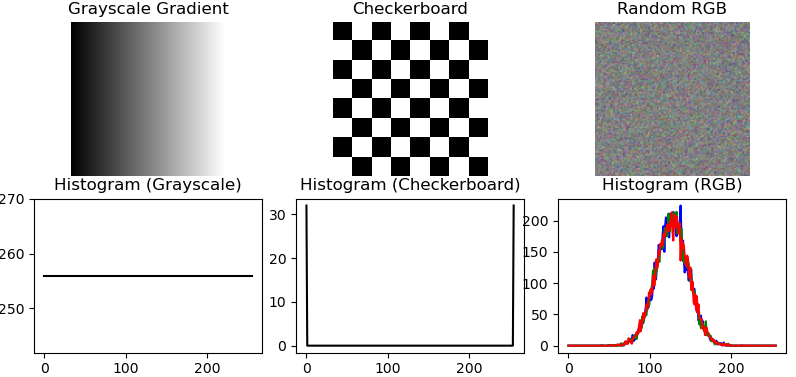

# Image Statistics and Histograms

## 🎯 Objective
The goal of this exercise is to practice extracting **statistical properties** from grayscale and color images using **NumPy** and **OpenCV**.  
You will implement missing parts of the code inside the function `get_image_info`.

At the end of this task you should be able to:
- Work with **NumPy arrays** that represent images.
- Extract **metadata** such as width, height, number of channels, data type, and memory size.
- Compute **statistical measures** for pixel values: minimum, maximum, mean, standard deviation, and median.
- Generate and analyze **histograms** of pixel intensities.
- Understand the difference between **grayscale** and **RGB** image analysis.

---

## 📝 Instructions

Open the file provided (`image_statistics.py`) and complete the missing parts marked between:

```python
### START CODE HERE ###
    ...
### END CODE HERE ###

```

## Example Output



